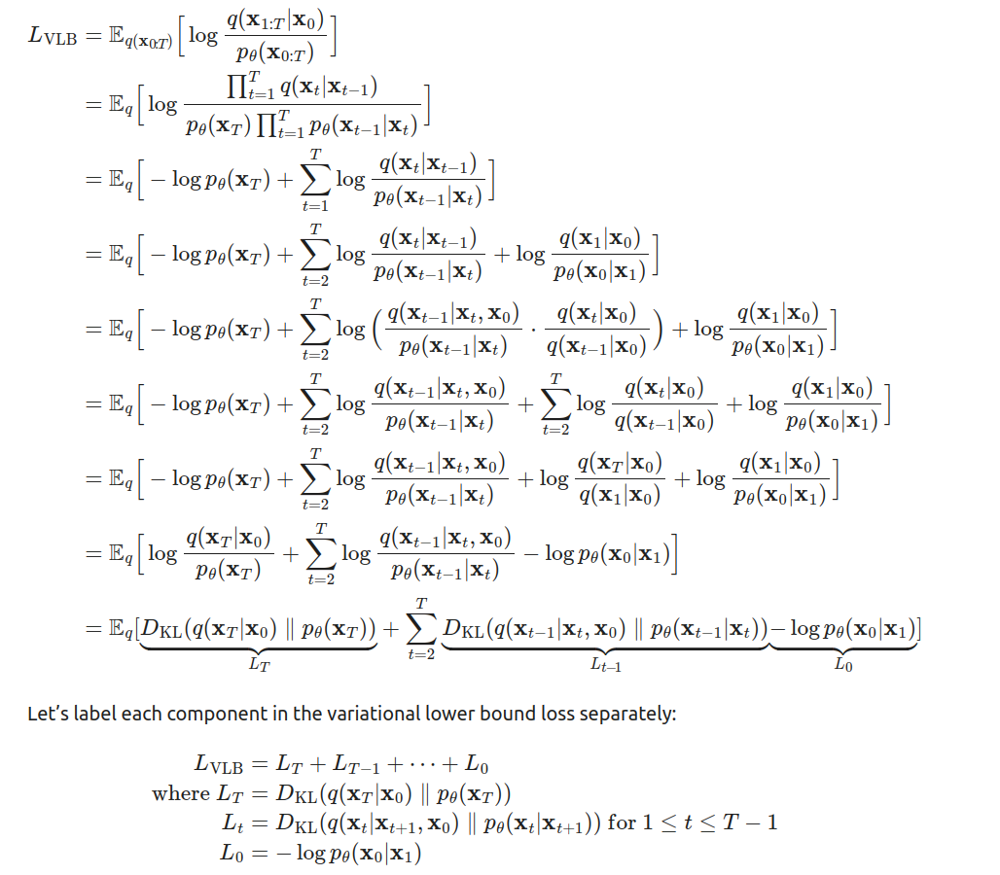

## Denoising Diffusion Implicit Models

DDIM will be beneficial in the regime when sampling steps less than 50, while in 1000 step the DDPM still outperform.

> DDIMs, a more efficient class of iterative implicit probabilistic models with same training procedure as DDPMs
> generalize DDPMs via a class of non-Mavkovian processes that lead to the same training objective.

for iterative generative models, DDPM or NCSN have demonstrated the ability to produce samples comparable to that of GANs,
to achieve this, denoising autoencoder models are trained to denoise samples corrupted by various levels of Gaussian noise.

drawbacks of these models is that they required many iterations to produce a high quality sample.

benefits of DDIMs:
1. efficient sampling procedure
2. consistency, the same initial latent variable with various lengths of Markov Chain will produce similar high-level features
3. perform semantically meaningful image interpolation by manipulating the initial latent variable in DDIMs

#### DDPM objective

as demonstrated in DDPMs:

the objective only depends on the marginals $q(x_{t}|x_{0})$ , so there are many inference distributions with the same marginals.

A family Q of inference distributions, indexed by a real vector $\sigma \in R_{\geq 0}^{T}$

the mean function can ensure that $q_{\sigma}(x_{t}|x_{0}) = N (\sqrt{\alpha_{t}}x_{0},(1-\alpha_{t})I)$

#### Generative Process

define a generative process $p_{\theta}(x_{0:T})$ where each $p_{\theta}^{t}(x_{t-1}|x_{t})$ leverage knowledge of $q_{\sigma}(x_{t-1}|x_{t},x_{0})$ 

we can predict the *denoised observation* which is a prediction of $x_{0}$ given $x_{t}$:

then we can define the generative process with a fixed prior $p_{\theta}(x_{T}) = N(0.I)$

a different model has to be trained for every choice of $\sigma$, since it corresponds to a different variational inference objective

 

we could use the pretrained DDPM models as the solutions to the new objectives by changing $\sigma$, retrain the model is unnecessary.

when $\sigma_{t} = \sqrt{(1-\alpha_{t-1})/(1-\alpha_{t})} \sqrt{1-\alpha_{t}/\alpha_{t-1}}$ for all t, the forward process becomes Markovian and the generative process becomes a DDPM.

when $\sigma_{t} = 0$ for all t, the forward process become deterministic given $x_{t-1}$ and $x_{0}$, the coefficient before the random noise $\epsilon_{t}$ becomes zero.

#### Accelerated generation processes

as the denoising objective $L$ does not depend on the specific forward procedure as long as $q_{\sigma}(x_{t}|x_{0})$ is fixed, we may also consider forward processes with lengths smaller than $T$, which accelerates the corresponding generative processes *without having to train a different model.*

it means the accelerated method not only can be applied to DDIM but also to DDPM.

### Experiments

#### Sample Quality and Efficiency

DDIMs outperform DDPMs in terms of image generation when fewer iterations are considered.

#### Sample Consistency in DDIM

as the reverse noise is zero in DDIMs, high level features of generated images under different generative  trajectories (different $t$) are similar when start from the same initial $x_{T}$.

#### Interpolation in Deterministic Generative Process

